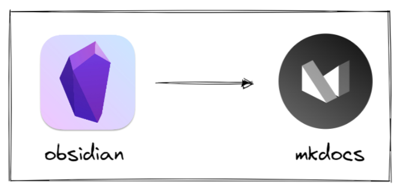
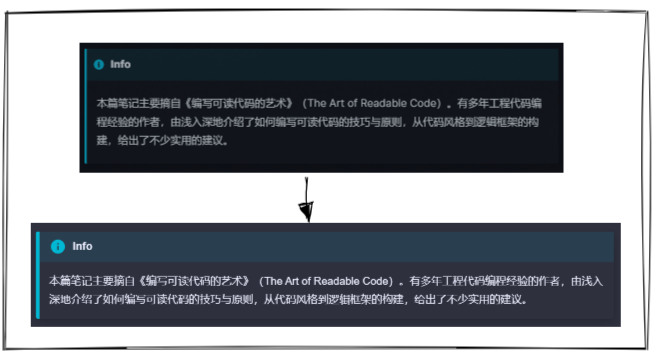

# TextConverter :curly_loop:

## Introduction
Obsidian is a markdown-based notes software, while MkDocs is a markdown-based content distribution platform. However, it is well known that markdown has quite a bit of **extended syntax** beyond the base standard. Plus Obsidian and MkDocs both have their own plugins. So, to do content **migration** in both software, sometimes you need to do some content modification.


## Features
### 1. Obsidian Admonition -> MkDocs Admonition
For the Obsidian admonition, the syntax is
````markdown
```ad-info
xxx
```
```` 
For the MkDocs admonition, the syntax is 
````markdown
!!! info
    xxx
````


### 2. Erase tags
In obsidian, you may add several tags, but in MkDocs, they are not rendered.